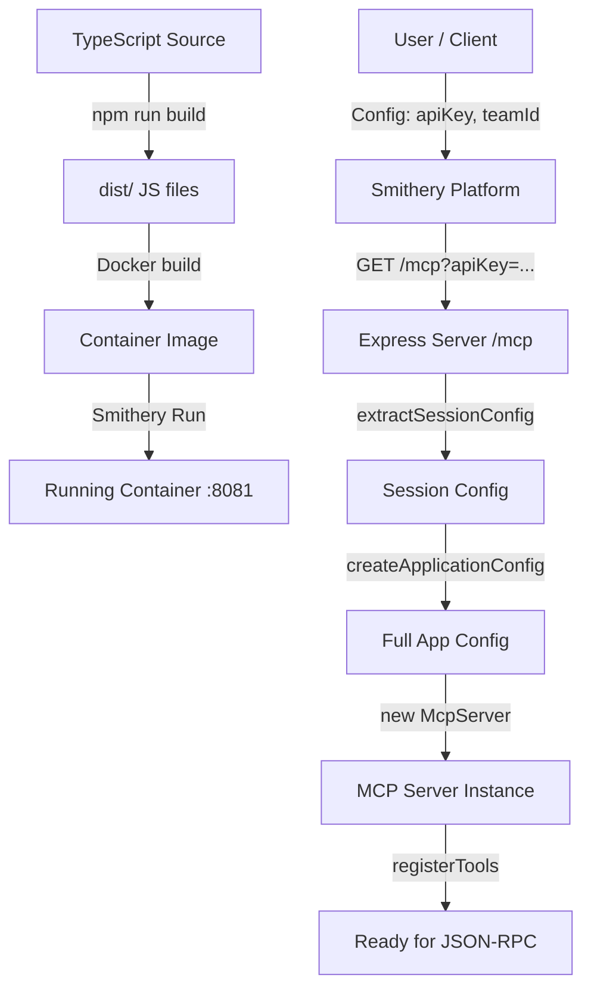

# Server Connection and Lifecycle

This document provides a detailed analysis of how the ClickUp MCP server operates, from its source files to a running, discoverable Smithery instance.

## 1. Build and Deployment Architecture

The server is designed to run as a **containerised HTTP service**.

### 1.1 The Build Process
1.  **Source**: TypeScript files in `src/`.
2.  **Compilation**: `npm run build` uses `tsc` to compile `src/` to `dist/`.
3.  **Packaging**: The `Dockerfile`:
    - Starts from `node:20-slim`.
    - Installs dependencies (`npm ci`).
    - Copies source and builds (`npm run build`).
    - Exposes port `8081`.
    - Sets `TRANSPORT=http`.
    - Sets the entrypoint to `node dist/server/index.js`.

### 1.2 Smithery Configuration
`smithery.yaml` bridges the gap between the container and the Smithery platform:
- **Runtime**: `container` tells Smithery to build and run the Dockerfile.
- **Start Command**: Specifies `type: "http"` and defines the **Configuration Schema**.
- **Config Schema**: Defines parameters (e.g., `apiKey`, `teamId`, `writeMode`) that Smithery presents to the user. These are passed to the server via **query parameters** during connection.

## 2. The Connection Lifecycle

When a client (like Smithery or an MCP-enabled IDE) connects to the server, the following process occurs:

### Step 1: Initialization & Discovery
1.  Smithery builds/starts the container.
2.  The server starts (see `src/server/index.ts`), listening on port `8081`.
3.  Smithery probes `GET /mcp` or uses the `smithery.yaml` metadata to understand the connection method.

### Step 2: Session Establishment
1.  The client sends a `POST` or `GET` request to `http://<host>:8081/mcp`.
2.  **Configuration Injection**: User-provided settings (API Key, Team ID) are appended as query parameters (e.g., `?apiKey=xyz&teamId=123`).
3.  **Transport Handshake**: `src/server/httpTransport.ts` handles the request.
    - `authenticationMiddleware` validates the session (if reusing one) or prepares for a new one.
    - `extractSessionConfig` parses the query parameters into a `SessionConfigInput` object.
    - `createApplicationConfig` merges this input with environment variables (e.g., `PORT`, `DEFAULT_CACHE_TTL`) to create the final `ApplicationConfig`.
4.  **Server Factory**: A new `McpServer` instance is created specifically for this session.
    - Tools are registered (`registerTools`) using the session-specific config.
    - Resources are registered (`registerResources`).
    - A `SessionCache` is initialized.

### Step 3: Interaction (JSON-RPC)
1.  The client sends JSON-RPC messages (e.g., `tools/call`) over the HTTP connection (using Server-Sent Events for responses).
2.  The `McpServer` instance routes the request to the appropriate tool in `src/mcp/`.
3.  The tool uses `src/application/usecases/` to perform business logic.
4.  The usecase calls `src/infrastructure/clickup/` to interact with the external API using the session's `apiKey`.

## 3. Key Components Analysis

### 3.1 HTTP Server (`src/server/index.ts`)
- Entry point.
- Sets up Express and CORS.
- Registers the `/mcp` endpoint via `registerHttpTransport`.
- Responds to `/healthz` for liveness checks.

### 3.2 Transport Layer (`src/server/httpTransport.ts`)
- Manages the mapping between HTTP requests and MCP sessions.
- **Crucial**: It creates a *fresh* MCP server instance for every new session. This allows different users/sessions to have different configurations (e.g., different API keys or write permissions) even though they hit the same HTTP endpoint.

### 3.3 Configuration Logic (`src/server/sessionConfig.ts` & `src/application/config/applicationConfig.ts`)
- **Session Config**: Extracted from HTTP query params. Matches `smithery.yaml` schema.
- **App Config**: The final source of truth. It follows a precedence rule:
  1.  **Session Config** (Query Params) - *Highest priority*
  2.  **Environment Variables** (e.g., `CLICKUP_API_TOKEN` in `.env`)
  3.  **Hardcoded Defaults**

## 4. Summary Flow

